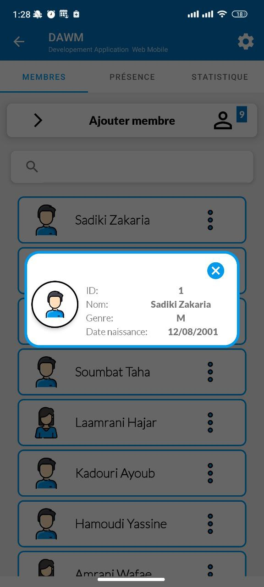
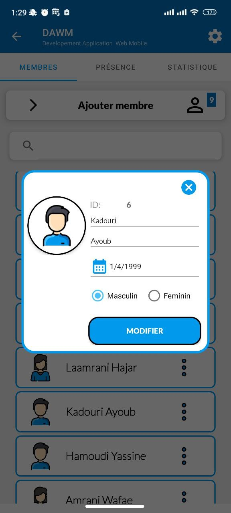
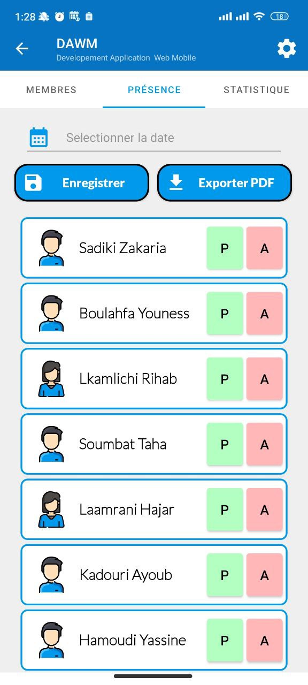
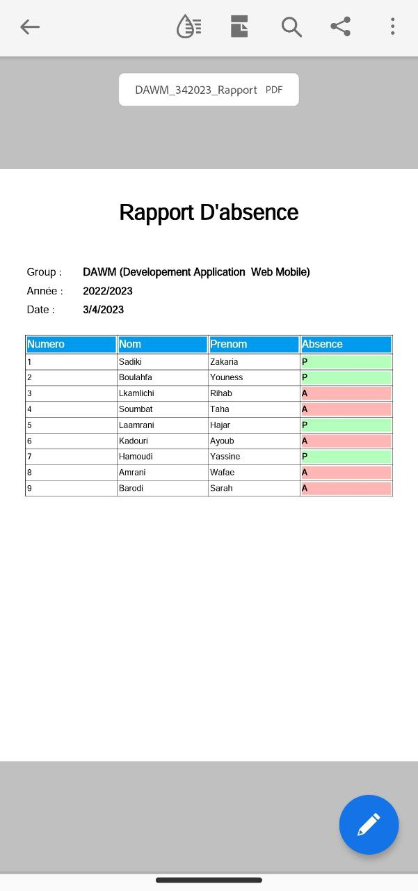
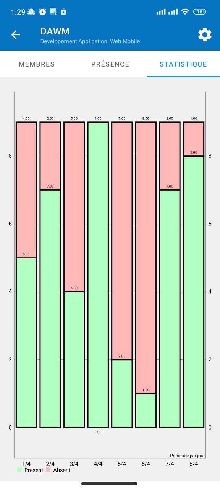

# Application Gestion D'absence | Attendance Manager App
Application Gestion D'absence pour Android développée à l'aide de Java et Firebase.

## Fonctionnalités
- interface utilisateur agréable et moderne
- Ajouter, modifier et supprimer les groupes
- Ajouter, modifier et supprimer des enregistrements de membre
- Gérer la présence des membres
- Imprimer les rapports de présence des membres PDF
- Afficher les statistiques sous forme des graphes

## Utilisation
1. Firebase comme une base de données externe
2. iText pour generer des raports sous forme PDF
3. MPAndroidChart pour generer des graphes

## Captures d'écran
### Ecran Authentification

### Ecran Groupes

### Ecran Membres

### Afficher Membres

### Creer Membres

### Modifier Membres

### Ecran Presance

### Presance Membres

### Rapport PDF

### Statistiqe Graphe

---
Merci d'avoir consulté mon projet !  
ariadiki 
---

